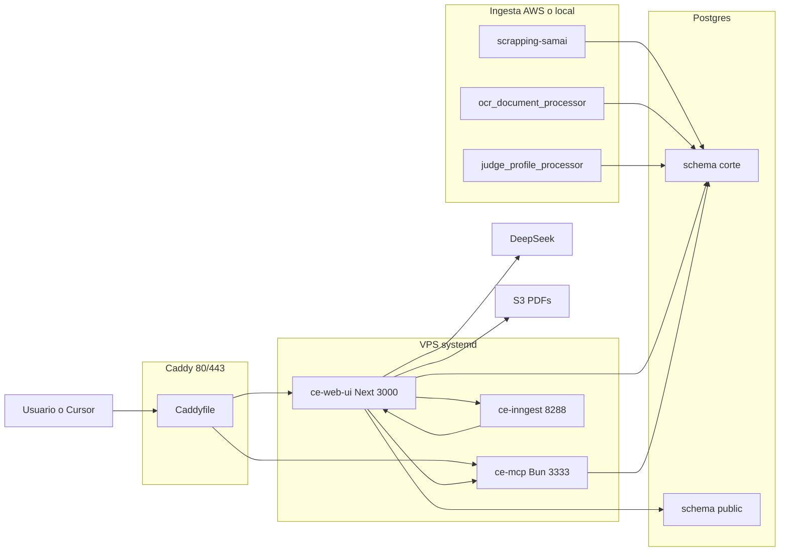

# Arquitectura — deley.com

## Qué es el proyecto

**deley.com** (track Access, Platanus Hack 26 Bogotá, team-19) resume lo **observable** de magistrados **ponentes** a partir de providencias reales del Consejo de Estado: directorio, fichas (volumen, sentidos, votos) y un chat con tools MCP.

No es un ranking oficial ni una tasa de éxito. El stack de la app es Next.js, Better Auth, Prisma, tRPC y PostgreSQL.

Deploy público: `http://206.189.200.33` (`platanus-hack-project.jsonc`).

Convenciones de código Next/Prisma: [AGENTS.md](AGENTS.md). Este archivo describe el producto y cómo encajan las piezas.

## Arquitectura (runtime)

## Capas y archivos principales

| Pieza | Rol | Dónde |
| --- | --- | --- |
| App web | Next 16, Better Auth, tRPC, Prisma, chat Inngest | [web-ui/](web-ui/) |
| Landing / fichas | Jueces y abogados, SEO | [web-ui/src/app/(landing)/](web-ui/src/app/(landing)/), [features/marketing](web-ui/src/features/marketing/), [features/judge-profile](web-ui/src/features/judge-profile/) |
| Dashboard | Chat, perfil, contacts (template) | [web-ui/src/app/dashboard/](web-ui/src/app/dashboard/) |
| API tRPC | `auth`, `chat`, `contact`, `juez` (presign PDF), `user` | [web-ui/src/trpc/routers/_app.ts](web-ui/src/trpc/routers/_app.ts) |
| Chat durable | POST `/api/chat` encola evento; Inngest corre `streamText` + MCP | [web-ui/src/app/api/chat/route.ts](web-ui/src/app/api/chat/route.ts), [generate-chat.ts](web-ui/src/features/chat/server/generate-chat.ts) |
| MCP | Tools: `search_providencias`, `get_providencia`, `search_perfiles`, `get_perfil`, `search_votos` | [services/mcp-server/](services/mcp-server/) |
| Postgres | `public` = auth/chat/contact (migraciones Prisma). `corte` = providencias/perfiles (dueño scraping) | [web-ui/prisma/models/](web-ui/prisma/models/) |
| Ingesta | Selenium SAMAI, OCR, step functions de perfiles | [services/scrapping-samai](services/scrapping-samai/), [ocr_document_processor](services/ocr_document_processor/), [judge_profile_processor](services/judge_profile_processor/) |
| Deploy | systemd `ce-web-ui`, `ce-mcp`, `ce-inngest`; Caddy proxy `/mcp*` vs resto | [deploy/systemd/](deploy/systemd/), [services/mcp-server/Caddyfile](services/mcp-server/Caddyfile) |

## Flujo de chat

El navegador no mantiene el SSE del modelo. `POST /api/chat` guarda mensajes en `public`, marca `generationStatus=running` y envía el evento Inngest. El job genera con DeepSeek y tools MCP, persiste snapshots en Postgres sin bloquear el pensamiento. La UI hace poll de `chat.get` mientras el run está `running`, así se puede cambiar de conversación y reconectar.
