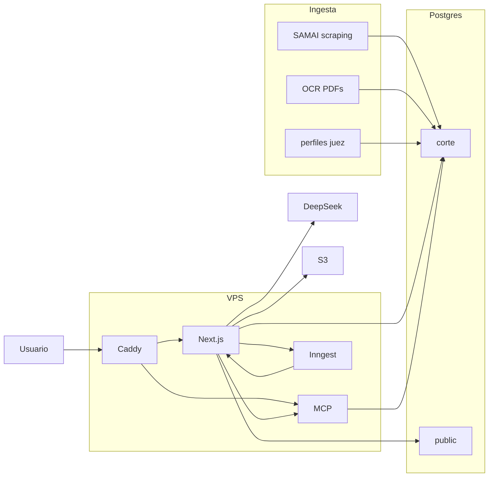

# deley.com

**Track:** Access · **Equipo:** team-19 (Bogotá)

**Que nadie enfrente a su juez sin conocerlo primero.**

## Problema

Poca accesibilidad a información de jueces y data desordenada. El historial público existe, pero no se consulta como un perfil claro.

## Solución

Convertimos las sentencias públicas de un juez en un perfil consultable: sabemos qué tipo de casos ven los jueces y qué argumentos siguen. Directorio, fichas y chat con tools MCP sobre providencias del Consejo de Estado.

## Impacto

Conseguimos la síntesis de esa información en segundos.

## Para quién

Quien va a enfrentar a un juez (o asesora a alguien que lo hace) y necesita conocer primero lo observable en providencias públicas: temas, sentidos, votos. No es ranking oficial ni tasa de éxito.

## Stack

Next.js (App Router), Better Auth, Prisma + PostgreSQL, tRPC, MCP, Inngest, DeepSeek, Bun, Caddy, Shadcn UI.

Detalle de piezas: [ARCHITECTURE.md](ARCHITECTURE.md). Deploy: `deploy-url` en [`platanus-hack-project.jsonc`](platanus-hack-project.jsonc).

## Arquitectura

